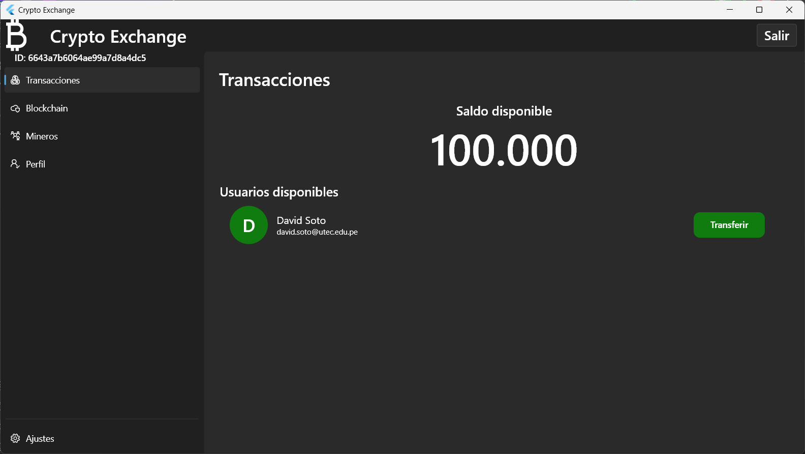

# Integrantes del proyecto
* Jorge Nicho Galagarza
* David Soto Aguirre

# Crypto Exchange Backend
Implementación backend para el servicio Crypto Exchange.

## Arquitectura
La implementación de este proyecto plantea la siguiente arquitectura

## Características
A continuación se muestran las principales características del servicio Toy Cryptocurrency

## Funcionalidades
A continuación mostramos 2 flujos de la aplicación: Login y registro de nuevos usuarios así como el flujo de transacciones utilizado por los usuarios para la transferencia de dinero.

|          |
|:----------------------------------------------------------:|
| *Diagrama de flujo de Login y Registro de nuevos usuarios* |

|  |
|:-------------------------------------------------------:|
|  *Diagrama de flujo de transacciones en el blockchain*  |

## Vistas de usuario
A continuación se muestran vistas de la aplicación frontend en su versión desktop.

* Registro de nuevos usuarios (Onboarding)

  Realizado de forma exitosa el registro de un nuevo usuario en la lógica de la aplicación se ha definido que el usuario tenga un saldo de inicial de 100 monedas.
  

* Login de usuario
  

* Login (Two-Factor Authentication)

Como mecanismo adicional de seguridad, luego de ingresar las credenciales correctas (usuario y contraseña), el usuario recibe en el inbox del correo registrado, un email con un código OTP necesario para realizar un login exitoso a la aplicación.

* Home

En la vista inicial, el usuario puede ver el saldo con el que dispone así como los usuarios registrados en la aplicación a los cuales potencialmente podría transferirles monedas.
