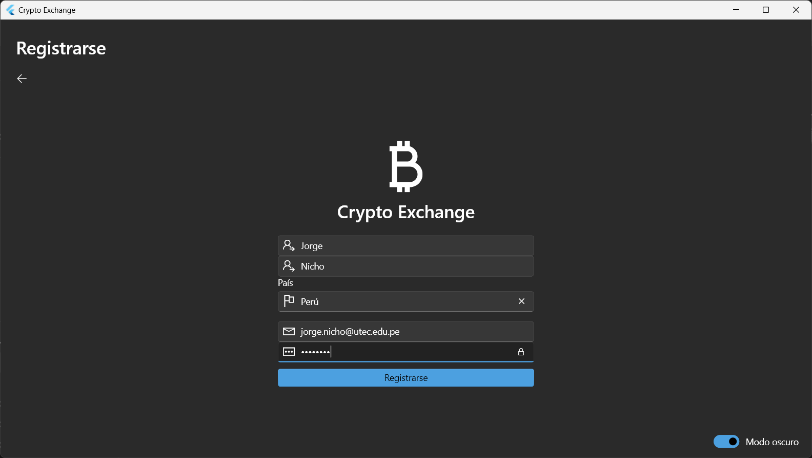
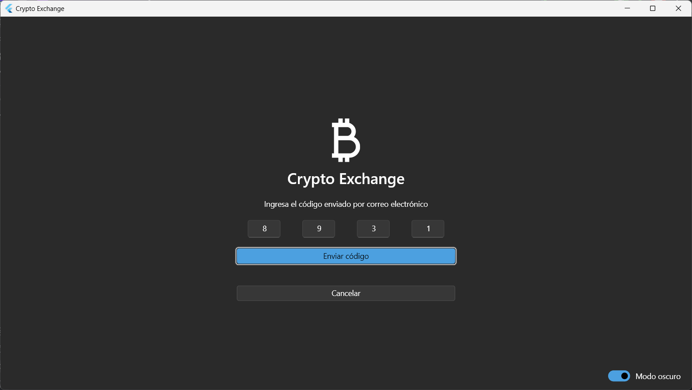
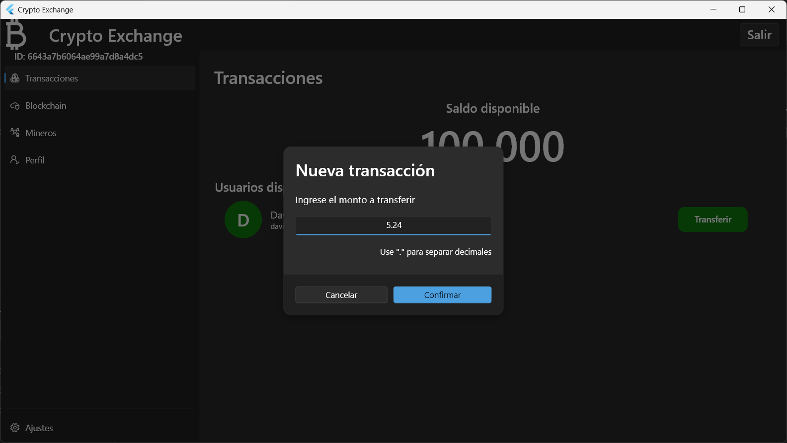
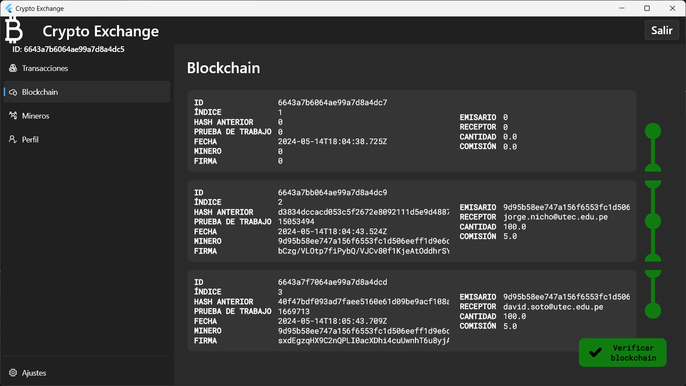
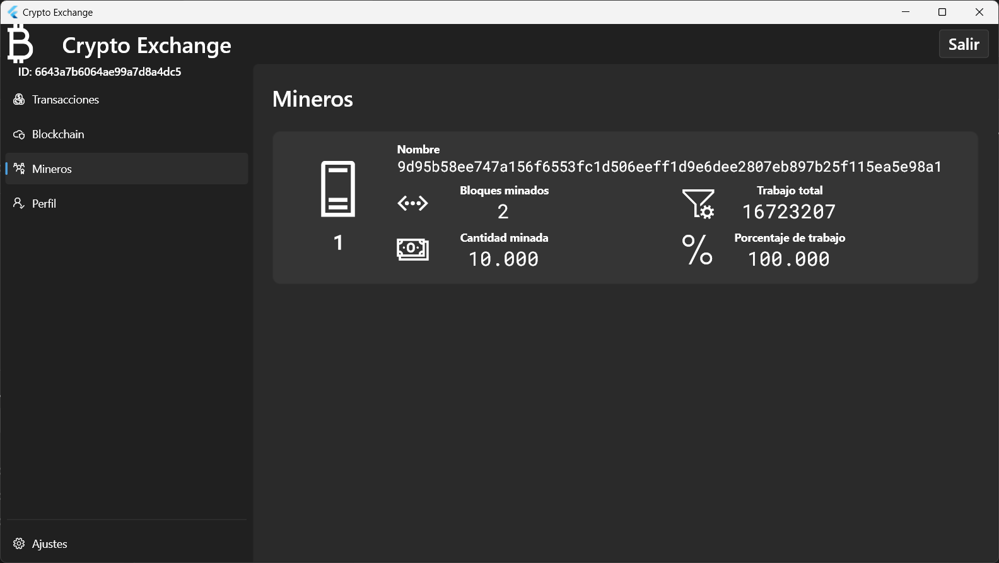
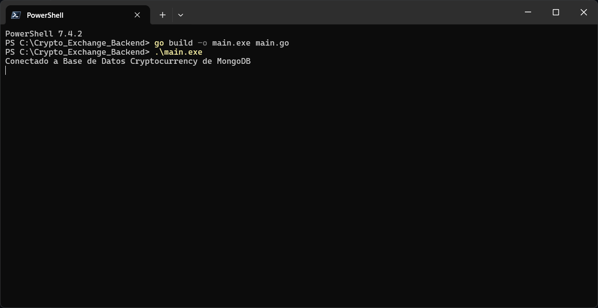

# Integrantes del proyecto
* Jorge Nicho Galagarza
* David Soto Aguirre

# Crypto Exchange Backend
Implementación backend para el servicio Crypto Exchange.

## Arquitectura
La implementación de este proyecto plantea la siguiente arquitectura


## Características
A continuación se muestran las principales características del servicio Toy Cryptocurrency


## Funcionalidades
A continuación mostramos 2 flujos de la aplicación: Login y registro de nuevos usuarios así como el flujo de transacciones utilizado por los usuarios para la transferencia de dinero.

|          |
|:----------------------------------------------------------:|
| *Diagrama de flujo de Login y Registro de nuevos usuarios* |

|  |
|:-------------------------------------------------------:|
|  *Diagrama de flujo de transacciones en el blockchain*  |

## Vistas de usuario
A continuación se muestran vistas de la aplicación frontend en su versión desktop.

* Registro de nuevos usuarios (Onboarding)

  Realizado de forma exitosa el registro de un nuevo usuario en la lógica de la aplicación se ha definido que el usuario tenga un saldo de inicial de 100 monedas.
  

* Login de usuario
  

* Login (Two-Factor Authentication)

Como mecanismo adicional de seguridad, luego de ingresar las credenciales correctas (usuario y contraseña), el usuario recibe en el inbox del correo registrado, un email con un código OTP necesario para realizar un login exitoso a la aplicación.


* Home

En la vista inicial, el usuario puede ver el saldo con el que dispone así como los usuarios registrados en la aplicación a los cuales potencialmente podría transferirles monedas.


* Transferencias

El usuario puede seleccionar la opción de *transferir* a otro usuario una cantidad disponible de su actual saldo.


* Blockchain

En esta sección se puede apreciar la cadena de bloques donde cada bloque representa una transacción la cual muestra información detallada de la misma como

```
ID: Identificador de la transacción
INDICE: Un número que se auto-incrementa por cada nueva transacción
HASH ANTERIOR: El hash que identifica el bloque anterior (transacción previa)
PRUEBA DE TRABAJO: El número de iteraciones que fue necesario para lograr identificar un hash particular el cual contiene una subcadena de inicio con 6 ceros (Ej: '000000ah8kmsx....fbz1')
FECHA: Registro de fecha y hora de la transacción.
MINERO: la dirección MAC (cifrada con Hash) del servidor que realizó el minado del bloque.
FIRMA: Firma del usuario que realizó la transacción registrada.
```



* Mineros

En esta sección se muestran las diferentes máquinas (nodo) que realizaron el minado del bloque. En esta imágen tenemos un nodo el cual realizó el minado del 100% de los bloques registrados en la blockchain.

```
Nombre: la dirección MAC (cifrada con Hash) del servidor que realizó el minado del bloque.
Bloques Minados:
Cantidad minada: la suma de todas las comisiones por los bloques minados
Trabajo total: la suma de todas las pruebas de trabajo de todos los bloques minados por este nodo expresado en número de iteraciones.
Porcentaje de trabajo: el porcentaje de trabajo que cada nodo ha realizado respecto al total de trabajo necesario para construir la blockchain (En la imagen se usó un nodo el cual realizó el 100% del trabajo)
```


* Perfil de usuario

En esta sección se encuentra información general del usuario así como la llave pública y privada utilizada para firmar sus transferencias.


## Instanciar aplicación
Clonando este repositorio podemos compilar el proyecto para generar el binario de la aplicación con el siguiente comando y posteriormente ejecutar el archivo .exe generado.

```
$ go build -o main.exe main.go
```


El ejemplo mostrado anteriormente es la compilación para un sistema operativo basado en windows, sin embargo se puede aprovechar la capacidad de cross-compilation de Go para generar un binario para otra plataforma, por ejemplo para sistema operativo Linux con arquitectura x86_64 con la siguiente instrucción:

```
$ env GOOS=linux GOARCH=amd64 go build -o app
```
